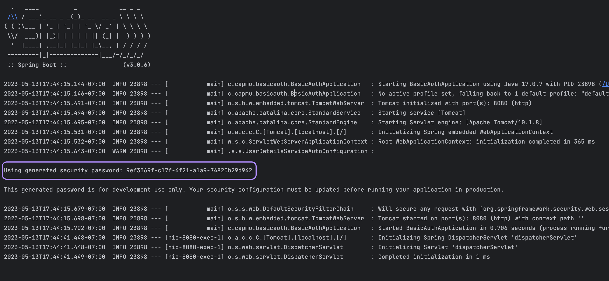

# springboot-basic-auth

### Note
- This repository focusing on **Spring Boot 3.0.6** and **Spring Security 6**
- Spring Security provides username as **'user'** by default, and the password will be generated when starting the application

### Reference
- [Learn Spring Security 6 with Spring Boot 3 | Crash Course | Say Good Bye to Deprecated APIs](https://www.youtube.com/watch?v=bB6A490Uh5M)